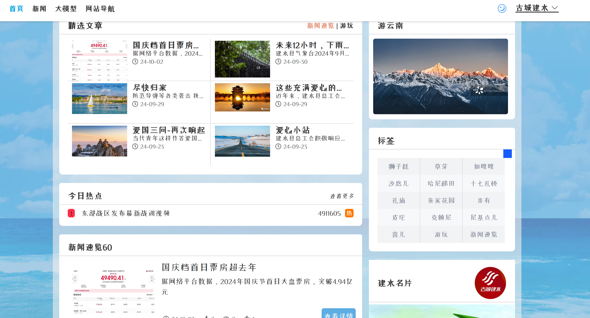

# 建水古城融媒体网站

## 网站演示

## 网站类型
前后端不作为主体分离，嵌入前后端分离
## 技术项
Python Django Vue Axios元素ui
## 介绍
这个网站是兴趣和学习的起点
分为主页、新闻、大模型、网站导航、后端页面、登录和注册页面
### 首页
展示了大量文章（来自古城建水微信公众号）。点击阅读详细文章。阅读页面与微信公众号显示一致。
一些简单的信息显示，云南移动游快速链接，建水方言标签，网站信息
底部显示：作为另一个信息补充界面，将鼠标放在右侧（点击手机）显示相应的二维码。显示的网站注册是假的。云南省招生考试院本次报名号为假
### 新闻：
此页面充满了通过网络爬行技术获得的数据，数据是实时的。微信的网络爬虫尚未实现
### 大模型：
实现与人工智能的通信，而不区分用户。来自个人的所有呼叫将一起显示，仅按日期区分。分类做得不好，主要是因为我想不出更好的方法
模型：百度Spark大模型
### 网站导航：
我整理了一份常用网站的清单
### 功能介绍不完整
其余页面需要登录才能查看。您可以注册，没有危险
在这一点上，我认为网站的发展可以结束。毫无疑问，仍有一些领域做得不好，存在漏洞。让我们赶紧结束第一个这样的大型项目吧！
但建水网站的开发只是第一个版本，我想我以后会做的！！！
## 写在末尾
2023年11月，我开始制作网页。虽然我做得不好，但这已经是我近一年的技术展示，也是我三个月努力的结果
您可以具体联系我：libai9123@outlook.com或2874382167@qq.com
记录我独立开发的第一个大型项目
2024.09

# Jianshui of Ancient city Integrated Media Website

## website demo

## Website Type:

The front and rear ends are not separated as the main body, embedded with front and rear end separation

## Technical item: 

Python Django Vue Axios element ui

## Introduction:

This website serves as a starting point for interest and learning

Divided into homepage, news, large model, website navigation, backend page, login and registration page

### home page

A large number of articles were displayed (from the ancient city Jianshui WeChat official account). Click to read the articles in detail. The reading page is consistent with the display of the WeChat official account.

Some simple information displays, quick links to a mobile tour of Yunnan, Jianshui dialect tags, website information

Bottom display: As another interface for information supplementation, place the mouse on the right (click on the phone) to display the corresponding QR code. The website registration displayed is fake. The registration number of Yunnan Admissions Examination Institute this time is false

### News:

This page is full of data obtained through web crawling technology, and the data is real-time. WeChat's web crawling has not been implemented

### Large model:

Implement communication with artificial intelligence without distinguishing between users. All calls from individuals will be displayed together, only differentiated by date. The classification was not done well, mainly because I couldn't think of a better way

Model: Baidu's Spark Big Model

### Website Navigation:

I have compiled a list of commonly used websites

### The function introduction is incomplete

The rest of the pages require login to view. You can register and there is no danger involved

At this point, I think the development of the website can come to an end. Without a doubt, there are still some areas that were not done well and had bugs. Let's hastily end the first large-scale project like this!

But the development of the Jianshui website is only the first version, I think I will do it later!!!

## Write at the end

In November 2023, I started working on web pages. Although I didn't do it well, it was already my technical showcase for almost a year and the result of my three months of hard work

You can contact me specifically:libai9123@outlook.com or 2874382167@qq.com

Record my first large-scale project developed independently

2024.09

